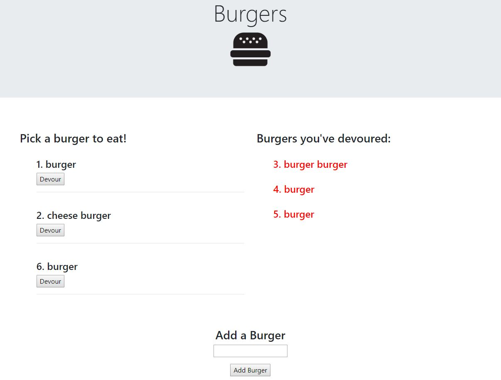

# Burger

## Summary
This is my Burger application. With this application, the user is able to create burgers, which they can then devour with the click of a button. 

## Site Pictures


## Technologies Used 
- HTML - Used to create elements on the DOM
- JS - Used to manipulate content on HTML
- JQuery - JavaScript library used for DOM manipulation
- Express - Web framework for Node.js
- Express-Handlebars - Express application templating
- Heroku - Cloud platform to deploy web applications
- Git - Version control system to track changes to source code
- Github - Hosts repository that can be deployed to GitHub pages

## Code Snippets
The following code uses express-handlebars to display each burger from the burgers table. It also appends a button to each burger with the data id attribute of the burgers id. This is how the 
```handlebars
{{#each burgers}}
{{#unless devoured}}
<h4>{{id}}. {{burger_name}}</h4>
<button class="devour" data-id="{{id}}">
    {{#if devoured}}{{else}}Devour{{/if}}
</button>
<hr><br>
{{/unless}}
{{/each}}
```

## Author Links
https://github.com/hagoodj